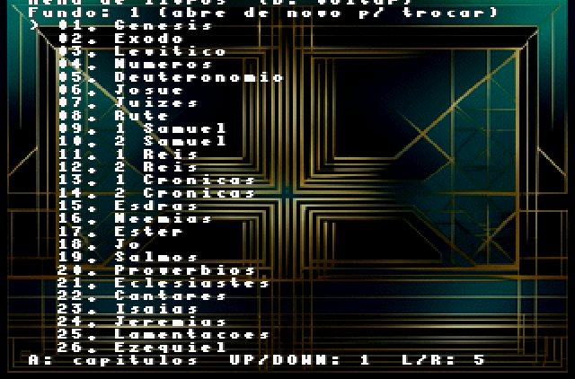
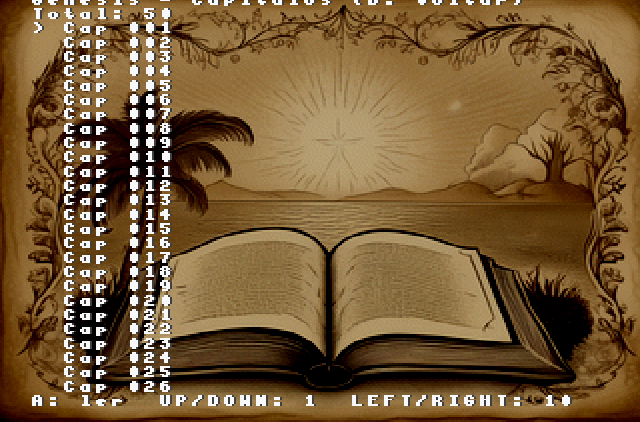
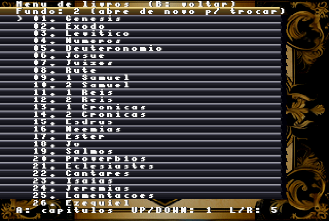
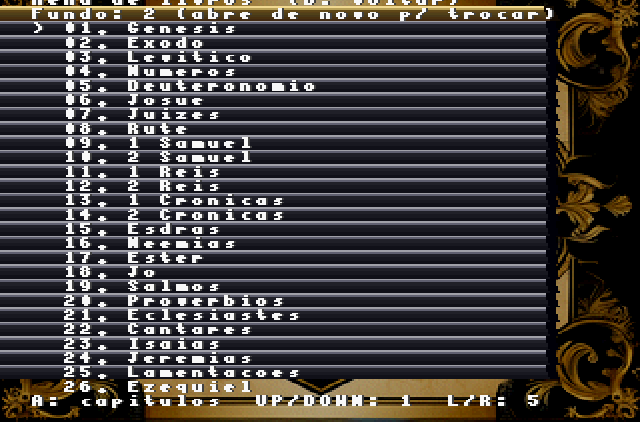

# Bíblia para Sega Saturn

Projeto com build jogável de Bíblia em português para Sega Saturn.

## Status
- Build final pronta em `saturn_app/game.iso` e `saturn_app/game.cue`.
- Screenshots prontos em `saturn_app/1.png`, `saturn_app/2.png`, `saturn_app/3.png`, `saturn_app/4.png` e `saturn_app/versiculo.png`.
- Repositório organizado para publicação no GitHub.

## ROMs finais
- `saturn_app/game.cue` (release oficial)
- `saturn_app/game.iso` (release oficial)

Esses dois arquivos são a release final que deve ficar versionada no repositório.

## Screenshots






## Estrutura principal
- `saturn_app/`: código-fonte da aplicação Saturn e artefatos de build.
- `saturn_app/cd/`: arquivos de dados do CD (texto, fontes, assets).
- `tools/`: scripts auxiliares para gerar assets.
- `acf_clean.json`: base de texto bíblico usada na geração.

## Requisitos para recompilar (opcional)
- Linux
- Python 3
- Jo Engine instalado (o `makefile` atual aponta para `/home/pi/joengine`)

## Como recompilar a ROM (opcional)
```bash
cd saturn_app
./compile.sh
```

Isso regenera os assets e produz novamente `game.iso` e `game.cue`.

## Teste rápido
Abra `saturn_app/game.cue` em um emulador de Sega Saturn (ex.: Yabause/Kronos/Mednafen) ou grave a imagem para uso em hardware real.
